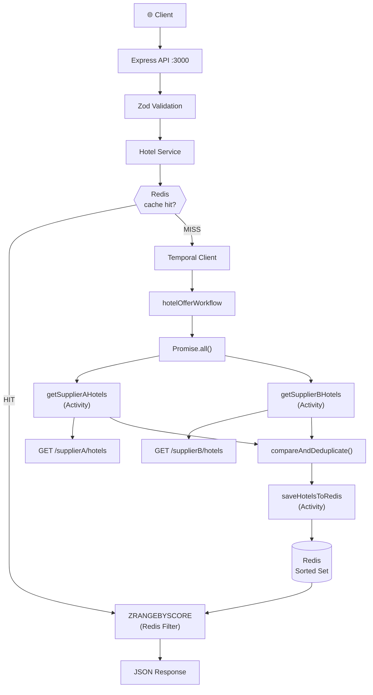

# Hotel Offer Orchestrator

A production-style hotel offer aggregation backend that fetches hotels from two mock suppliers in parallel via **Temporal.io**, deduplicates offers by selecting the cheapest price per hotel, stores results in **Redis Sorted Sets**, and serves them through an **Express API** with price-range filtering performed entirely inside Redis.

---

## Problem Statement

Hotel aggregation systems need to query multiple supplier APIs, compare overlapping hotels, and return the best offer to the end user — all with low latency, resilience to supplier failures, and accurate price filtering. This project demonstrates how to solve that with:

- **Temporal.io** for reliable, distributed workflow orchestration
- **Redis Sorted Sets** for fast, server-side price filtering
- **Clean architecture** separating concerns across controllers, services, activities, and workflows

---

## Architecture



---

## Tech Stack

| Layer | Technology |
|---|---|
| Runtime | Node.js 20 |
| Language | TypeScript (strict) |
| HTTP Framework | Express.js |
| Workflow Orchestration | Temporal.io |
| Cache / Storage | Redis 7 (Sorted Sets) |
| HTTP Client | Axios |
| Validation | Zod |
| Logging | Pino + pino-http |
| Testing | Vitest + Supertest |
| Containerization | Docker + Docker Compose |
| API Testing | Postman |

---

## Folder Structure

```
hotel-offer-orchestrator/
├── src/
│   ├── app.ts                          # Express app factory
│   ├── server.ts                       # HTTP server entry point
│   ├── config/
│   │   └── env.ts                      # Environment variable parsing
│   ├── controllers/
│   │   ├── hotel.controller.ts         # GET /api/hotels + /health
│   │   └── supplier.controller.ts      # GET /supplierA|B/hotels
│   ├── middleware/
│   │   └── error.middleware.ts         # Centralized error handler
│   ├── redis/
│   │   └── redis.client.ts             # Redis singleton client
│   ├── routes/
│   │   ├── hotel.routes.ts
│   │   └── supplier.routes.ts
│   ├── services/
│   │   └── hotel.service.ts            # Business logic: cache + workflow
│   ├── suppliers/
│   │   ├── supplierA.ts                # Mock data for Supplier A
│   │   └── supplierB.ts                # Mock data for Supplier B
│   ├── temporal/
│   │   ├── client.ts                   # Temporal WorkflowClient
│   │   ├── worker.ts                   # Worker process entry point
│   │   ├── activities/
│   │   │   ├── supplier.activities.ts  # HTTP fetch activities
│   │   │   └── redis.activities.ts     # Redis read/write activities
│   │   └── workflows/
│   │       └── hotel.workflow.ts       # Main orchestration workflow
│   ├── types/
│   │   └── hotel.types.ts              # HotelOffer + Zod schema
│   └── utils/
│       ├── comparison.ts               # compareAndDeduplicate() — pure
│       └── logger.ts                   # Pino logger instance
├── tests/
│   ├── comparison.test.ts              # Unit tests for comparison logic
│   └── hotel.routes.test.ts            # Integration tests for API routes
├── postman/
│   └── hotel-offer-orchestrator.postman_collection.json
├── temporal-config/
│   └── development-sql.yaml            # Temporal dynamic config (SQLite)
├── Dockerfile                          # Multi-stage build
├── docker-compose.yml                  # 4-service stack
├── .env.example
├── .gitignore
├── tsconfig.json
├── vitest.config.ts
└── README.md
```

---

## Prerequisites

- [Node.js 20+](https://nodejs.org/)
- [Docker Desktop](https://www.docker.com/products/docker-desktop/) (includes Docker Compose v2)

---

## Local Setup

### 1. Clone and Install

```bash
git clone <repository-url>
cd hotel-offer-orchestrator
npm install
```

### 2. Configure Environment

```bash
cp .env.example .env
```

For local development (without Docker), update `.env`:

```env
PORT=3000
NODE_ENV=development

REDIS_HOST=localhost
REDIS_PORT=6379

TEMPORAL_ADDRESS=localhost:7233
TEMPORAL_NAMESPACE=default
TEMPORAL_TASK_QUEUE=hotel-offer-task-queue

SUPPLIER_A_BASE_URL=http://localhost:3000
SUPPLIER_B_BASE_URL=http://localhost:3000
```

---

## Running with Docker (Recommended)

The simplest way to run the full stack:

```bash
docker compose up --build
```

This starts:
- **redis** — Redis 7 on port 6379
- **temporal** — Temporal server (auto-setup with SQLite) on port 7233
- **api** — Express API on port 3000
- **worker** — Temporal worker (no exposed port)

### Verify it's running

```bash
curl http://localhost:3000/health
```

Expected:
```json
{
  "status": "UP",
  "redis": "UP",
  "temporal": "UP",
  "suppliers": {
    "supplierA": "UP",
    "supplierB": "UP"
  }
}
```

### Stop the stack

```bash
docker compose down
```

### Destroy all data (including Redis volumes)

```bash
docker compose down -v
```

---

## Running Without Docker (Development)

You'll need Redis and Temporal running locally.

### Start Redis

```bash
docker run -d -p 6379:6379 redis:7-alpine
```

### Start Temporal (dev server)

```bash
npx @temporalio/core-bridge temporal server start-dev
```

Or use the [Temporal CLI](https://docs.temporal.io/cli):

```bash
temporal server start-dev
```

### Start the API (with hot reload)

```bash
npm run dev
```

### Start the Temporal Worker (separate terminal)

```bash
npm run worker
# or with hot reload:
npm run dev:worker
```

---

## API Documentation

### GET `/api/hotels`

Aggregates hotel offers for the given city, deduplicates by name (cheapest wins), stores in Redis, and returns results.

**Query Parameters:**

| Parameter | Type | Required | Description |
|---|---|---|---|
| `city` | string | ✅ Yes | City to search (case-insensitive) |
| `minPrice` | number | ❌ No | Minimum price inclusive |
| `maxPrice` | number | ❌ No | Maximum price inclusive |

**Example requests:**

```bash
# All hotels for Delhi
curl "http://localhost:3000/api/hotels?city=delhi"

# Hotels between ₹5000 and ₹7000
curl "http://localhost:3000/api/hotels?city=delhi&minPrice=5000&maxPrice=7000"

# Hotels above ₹6000
curl "http://localhost:3000/api/hotels?city=delhi&minPrice=6000"

# Hotels below ₹6000
curl "http://localhost:3000/api/hotels?city=delhi&maxPrice=6000"
```

**Example response:**

```json
[
  {
    "name": "Holtin",
    "price": 5340,
    "supplier": "Supplier B",
    "commissionPct": 20
  },
  {
    "name": "Radison",
    "price": 5900,
    "supplier": "Supplier A",
    "commissionPct": 13
  }
]
```

**Validation errors (400):**

```bash
# Missing city
curl "http://localhost:3000/api/hotels"
# → 400: {"error":"city is required"}

# Non-numeric price
curl "http://localhost:3000/api/hotels?city=delhi&minPrice=abc"
# → 400: {"error":"Expected number, received nan"}

# minPrice > maxPrice
curl "http://localhost:3000/api/hotels?city=delhi&minPrice=8000&maxPrice=5000"
# → 400: {"error":"minPrice must be less than or equal to maxPrice"}

# Unknown city
curl "http://localhost:3000/api/hotels?city=unknown"
# → 200: []
```

---

### GET `/health`

Returns health status of all system components.

```bash
curl "http://localhost:3000/health"
```

```json
{
  "status": "UP",
  "redis": "UP",
  "temporal": "UP",
  "suppliers": {
    "supplierA": "UP",
    "supplierB": "UP"
  }
}
```

If any dependency is unavailable, `status` becomes `"DEGRADED"` and the affected component reports `"DOWN"`.

---

### GET `/supplierA/hotels` and `/supplierB/hotels`

Mock supplier endpoints that return static hotel data.

```bash
curl "http://localhost:3000/supplierA/hotels?city=delhi"
curl "http://localhost:3000/supplierB/hotels?city=delhi"
```

**Supported cities:** `delhi`, `mumbai`, `bangalore`

**Failure simulation** (for testing Temporal retries):

```bash
curl "http://localhost:3000/supplierA/hotels?city=delhi&fail=true"
# → 503 Service Unavailable
```

---

## Mock Data

### Delhi (Supplier A)
| Hotel | Price | Commission |
|---|---|---|
| Holtin | ₹6,000 | 10% |
| Radison | ₹5,900 | 13% |
| Taj Palace | ₹7,500 | 15% |
| The Leela | ₹9,200 | 12% |

### Delhi (Supplier B)
| Hotel | Price | Commission |
|---|---|---|
| Holtin | ₹5,340 | 20% |
| Radison | ₹6,200 | 12% |
| Marriott | ₹8,200 | 18% |
| The Leela | ₹9,200 | 17% |

### Deduplicated Delhi Result
| Hotel | Price | Supplier | Reason |
|---|---|---|---|
| Holtin | ₹5,340 | Supplier B | B cheaper (5340 < 6000) |
| Radison | ₹5,900 | Supplier A | A cheaper (5900 < 6200) |
| Taj Palace | ₹7,500 | Supplier A | Only in A |
| Marriott | ₹8,200 | Supplier B | Only in B |
| The Leela | ₹9,200 | Supplier A | Tie → Supplier A wins |

---

## Redis Design

### Key Pattern

```
hotel:offers:{city}
```

Example: `hotel:offers:delhi`

### Data Structure: Sorted Set

Each hotel is stored as a **Redis Sorted Set** member where:
- **Score** = hotel price (enables range queries)
- **Member** = JSON-serialised `HotelOffer` object

```
ZADD hotel:offers:delhi 5340 '{"name":"Holtin","price":5340,...}'
ZADD hotel:offers:delhi 5900 '{"name":"Radison","price":5900,...}'
ZADD hotel:offers:delhi 7500 '{"name":"Taj Palace","price":7500,...}'
```

### Price Filtering

Filtering is performed **entirely inside Redis** using `ZRANGEBYSCORE`:

```
ZRANGEBYSCORE hotel:offers:delhi 5000 7000
```

This is equivalent to:
```
minPrice=5000 AND maxPrice=7000
```

- Default `minPrice` = `0`
- Default `maxPrice` = `+inf` (Redis notation)

**The API never loads all hotels into JavaScript to filter them.**

### TTL

Each key expires after **24 hours** to prevent stale data accumulation.

---

## Temporal Architecture

### Overview

```
Express API
    │
    ▼ temporalClient.start('hotelOfferWorkflow', { args: [city] })
Temporal Server
    │
    ▼ routes to worker via task queue
hotel-offer-task-queue
    │
    ▼
Worker Process
    │
    ▼
hotelOfferWorkflow(city)
    │
    ├── Promise.all([
    │       getSupplierAHotels(city),   ← Activity (HTTP)
    │       getSupplierBHotels(city),   ← Activity (HTTP)
    │   ])
    │
    ├── compareAndDeduplicate()         ← Pure function (in workflow)
    │
    └── saveHotelsToRedis(city, hotels) ← Activity (Redis)
```

### Components

| Component | File | Responsibility |
|---|---|---|
| **Client** | `src/temporal/client.ts` | Singleton WorkflowClient for starting workflows |
| **Worker** | `src/temporal/worker.ts` | Listens on task queue, executes activities |
| **Workflow** | `src/temporal/workflows/hotel.workflow.ts` | Orchestration logic (deterministic) |
| **Supplier Activities** | `src/temporal/activities/supplier.activities.ts` | HTTP calls to supplier endpoints |
| **Redis Activities** | `src/temporal/activities/redis.activities.ts` | Redis read/write operations |

### Activity Retry Policy

All supplier activities are configured with:

```typescript
retry: {
  initialInterval: '1 second',
  backoffCoefficient: 2,
  maximumAttempts: 3,
}
```

Retry timeline:
- Attempt 1: immediately
- Attempt 2: after 1 second
- Attempt 3: after 2 seconds
- Failure → workflow fails → API returns 500

### Task Queue

```
hotel-offer-task-queue
```

Configured via `TEMPORAL_TASK_QUEUE` environment variable.

---

## Deduplication Logic

The `compareAndDeduplicate()` function in `src/utils/comparison.ts` is a **pure function** with O(A+B) complexity:

```
1. Create empty Map<normalised-name, HotelOffer>

2. For each Supplier A hotel:
   - If not in map → add it
   - If in map and cheaper → replace (preserve display name)

3. For each Supplier B hotel:
   - If not in map → add it
   - If in map and B is cheaper → replace (preserve display name)
   - If prices equal → keep Supplier A (tie-breaker)

4. Return Map values as array
```

**Edge cases handled:**
- Empty supplier arrays
- Hotel in only one supplier
- Case-insensitive name matching (`"HOLTIN" == "holtin"`)
- Original display name preserved
- Duplicate names within same supplier (cheapest kept)
- Same price → Supplier A wins (documented tie-breaker)

---

## Error Handling

### Propagation Path

```
Supplier failure (HTTP 503)
    ↓
Temporal Activity throws error
    ↓
Temporal retries (up to 3 times)
    ↓
Workflow fails (ApplicationFailure)
    ↓
hotel.service throws
    ↓
hotel.controller catches → next(err)
    ↓
error.middleware.ts → { "error": "Failed to fetch hotel offers" }
    ↓
HTTP 500
```

### What clients see

```json
{ "error": "Failed to fetch hotel offers" }
```

Stack traces and internal details are **never** sent to clients. All errors are logged server-side with full context.

---

## Logging

Structured JSON logging via Pino (pretty output in development).

Key log events:

```
INFO  Request received: GET /api/hotels
INFO  Service: cache miss — starting Temporal workflow
INFO  Service: starting hotel offer workflow (workflowId=...)
INFO  Activity: fetching Supplier A hotels
INFO  Activity: fetching Supplier B hotels
INFO  Activity: Supplier A response received (count=3)
INFO  Activity: Supplier B response received (count=4)
INFO  Activity: saving hotels to Redis (count=5)
INFO  Activity: Redis save complete
INFO  Service: workflow completed
INFO  Service: querying Redis Sorted Set (min=0, max=+inf)
INFO  Service: Redis filter complete (count=5)
INFO  Request complete: GET /api/hotels (count=5)
```

---

## Testing

### Unit Tests

Tests for the pure comparison logic (no infrastructure required):

```bash
npm test
```

### Watch Mode

```bash
npm run test:watch
```

### Coverage Report

```bash
npm run test:coverage
```

### Test Cases Covered

**Comparison logic (comparison.test.ts):**
1. Supplier A cheaper → A wins
2. Supplier B cheaper → B wins
3. Hotel only in Supplier A → keeps A
4. Hotel only in Supplier B → keeps B
5. Equal prices → Supplier A wins (tie-breaker)
6. Empty Supplier A
7. Empty Supplier B
8. Both empty
9. Full Delhi dataset deduplication
10. Case-insensitive name matching
11. Intra-supplier duplicates

**API validation (hotel.routes.test.ts):**
1. Missing city → 400
2. Empty city → 400
3. Non-numeric minPrice → 400
4. Non-numeric maxPrice → 400
5. Negative minPrice → 400
6. Negative maxPrice → 400
7. minPrice > maxPrice → 400
8. Valid city → 200
9. Valid city + minPrice → 200
10. Valid city + maxPrice → 200
11. Valid full price range → 200
12. Response shape (no internal fields)
13. Supplier A happy path
14. Supplier A unknown city
15. Supplier A fail=true → 503
16. Supplier B tests
17. Health check shape

---

## Postman Collection

Import from:

```
postman/hotel-offer-orchestrator.postman_collection.json
```

Set collection variable `baseUrl` to `http://localhost:3000` (default).

Includes 15 requests covering all scenarios:
- Hotel fetching with full deduplication
- Price range filtering
- Unknown city (empty response)
- Invalid parameters (400 errors)
- Health check
- Direct supplier endpoints
- Failure simulation for retry testing

---

## npm Scripts

| Script | Description |
|---|---|
| `npm run dev` | Start API server with hot reload (tsx) |
| `npm run dev:worker` | Start Temporal worker with hot reload |
| `npm run build` | Compile TypeScript to dist/ |
| `npm start` | Start compiled API server |
| `npm run start:worker` | Start compiled worker |
| `npm run worker` | Start worker with tsx (no hot reload) |
| `npm test` | Run all tests once |
| `npm run test:watch` | Run tests in watch mode |
| `npm run test:coverage` | Run tests with coverage report |

---

## Docker Commands

```bash
# Build and start full stack
docker compose up --build

# Start in background
docker compose up -d --build

# View logs
docker compose logs -f api
docker compose logs -f worker

# Stop stack
docker compose down

# Stop and remove volumes
docker compose down -v

# Rebuild a single service
docker compose build api
docker compose up --no-deps api
```

---

## Assumptions & Design Decisions

1. **Tie-breaker**: When two suppliers offer the same price for a hotel, **Supplier A wins**. This is deterministic and documented.

2. **Display name preservation**: The original display name from the first supplier seen is preserved even when the cheaper offer comes from the other supplier.

3. **Cache-first strategy**: The API checks Redis before starting a Temporal workflow. If data exists, the workflow is skipped. Data expires after 24 hours (TTL).

4. **Redis key normalisation**: City names are lowercased and trimmed before use as Redis keys (`hotel:offers:delhi`).

5. **Worker isolation**: The API server and Temporal worker run as separate processes/containers. The API never executes activities directly.

6. **No JavaScript-level price filtering**: All price filtering is done inside Redis via `ZRANGEBYSCORE`. The JavaScript layer only deserialises the results.

7. **Atomic Redis writes**: A pipeline (`MULTI`) is used to atomically delete the old sorted set and write the new one, preventing partial reads.
